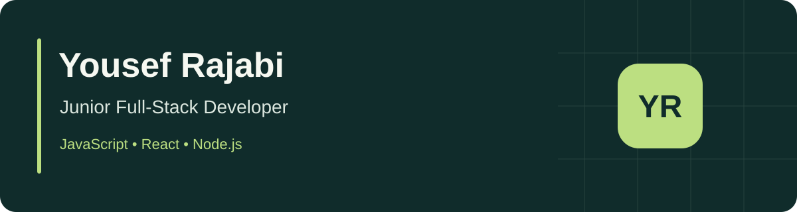

# Yousef Rajabi

**Junior Full-Stack Developer · Full-Stack Student**

JavaScript · React · Node.js · Express · Git · GitHub

## About Me

I am learning full-stack development by building practical web applications: responsive interfaces, API integrations, forms, and small backend services. My current focus is JavaScript and React, while I build confidence with Node.js, Express, and SQL.

**Open to Junior Frontend / Junior Full-Stack roles and internships, especially in Qatar and the Gulf. Willing to relocate for a suitable opportunity.**

## Tech Stack

- **Frontend:** HTML, CSS, JavaScript, React, Fetch API, responsive design
- **Backend practice:** Node.js, Express, REST APIs, SQLite
- **Tools:** Git, GitHub, Vite, Playwright, GitHub Actions

## Featured Projects

| Project | What to explore | Live demo |
| --- | --- | --- |
| [PennyScope](https://github.com/yousefrajabi06-debug/pennyscope) | React cash-flow dashboard, integer-cent calculations, category charts, CSV export | [Open app](https://yousef-pennyscope.netlify.app/) |
| [GatherBoard](https://github.com/yousefrajabi06-debug/gatherboard) | React + Express + SQLite; server validation, reservations, capacity transactions | [Browser preview](https://yousef-gatherboard.netlify.app/) |
| [Daymark Calendar](https://github.com/yousefrajabi06-debug/daymark-calendar) | Public holiday API, cancellable requests, loading/error states, ICS export | [Open app](https://yousef-daymark.netlify.app/) |
| [ApplyTrack](https://github.com/yousefrajabi06-debug/applytrack) | Job-search pipeline, validated forms, search, filters, local persistence | [Open app](https://yousef-applytrack.netlify.app/) |
| [Recall Studio](https://github.com/yousefrajabi06-debug/recall-studio) | Vanilla JavaScript flashcards, DOM events, review-session state | [Open app](https://yousef-recall-studio.netlify.app/) |
| [CoachFlow](https://github.com/yousefrajabi06-debug/coachflow) | React client dashboard, reusable components, detail views, computed summaries | [Open app](https://yousef-coachflow.netlify.app/) |

GatherBoard's hosted preview stores fictional data in the browser; its Express/SQLite version runs locally. The other demos are frontend applications. These are **AI-assisted learning projects**, with tests, limitations, and rebuild exercises documented in each repository. They are not client work or claims of professional experience.

## Team Contribution

[Masari](https://github.com/MDBASHERx/Masari) — a team learning-platform project. My frontend contributions include chat, career, and progress interfaces. The wider application's backend is team work.

## What I'm Currently Learning

- JavaScript fundamentals, async/await, and React state/effects
- Accessible forms, reliable API error handling, and meaningful browser tests
- Express request validation, SQL relationships, and the basics needed before adding authentication

## Links

[GitHub](https://github.com/yousefrajabi06-debug) · Explore the live portfolio projects above.
